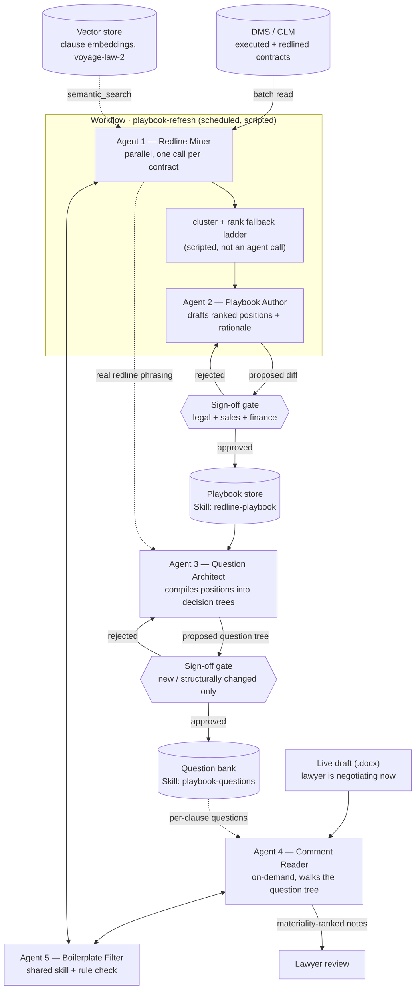

# Redline Playbook Architecture

A five-agent architecture, built on Claude Code, for mining redlines across a contract corpus, authoring a negotiation playbook, compiling that playbook into a machine-checkable question tree, reading a live negotiation's comments, and filtering out boilerplate noise.

This repo is both the research writeup and a working scaffold: `.claude/agents`, `.claude/skills`, `.claude/hooks`, and `.claude/workflows` are real starting points, not just documentation.

## Summary

The five roles split along one axis: **how much data they touch** and **how reversible their output is**.

- Mining redlines across a corpus and filtering boilerplate are high-volume, low-stakes, read-only work — they belong in a scripted **Workflow** and run **autonomously**.
- Authoring the playbook, and compiling it into the question tree an evaluator actually runs, are lower-volume but govern everything downstream — they run as **subagents behind a human-approval gate**: full sign-off for new positions, lighter re-review only when a compiled question tree changes structurally.
- Reading a live negotiation and drafting a reply is the one genuinely interactive piece, and it runs as an **on-demand subagent**, gated only at the point it would actually send something.

The taxonomy, the current playbook, the compiled question bank, and the boilerplate list live as **Skills** (versioned reference data every agent reads). **Hooks** enforce that no agent ever writes to a live contract, the canonical playbook, or the question bank without a permission check. **MCP** is the wire to a DMS/CLM and a vector store. Semantic retrieval sits underneath all five agents as a shared clause-level index, not a separate agent.

## System map



`Agent 5` (Boilerplate Filter) is drawn as a shared component, not a pipeline stage of its own — both the batch miner and the live comment reader call the same rule, so a clause is never "boilerplate" in one pipeline and "substantive" in the other.

## The five agents

### 1. Redline Miner — `autonomous`

*"Sits hidden behind the contract" — reads every redline as data, across the whole corpus, and never touches a live document.*

| | |
|---|---|
| **Primitive** | A pipeline stage inside a **Workflow** script (`agent()` called once per contract via `pipeline()`/`parallel()`), not an ad hoc subagent — dozens to hundreds of contracts need resumability, per-phase cost tracking, and a deterministic audit trail a turn-by-turn delegation can't give. |
| **Reads** | Executed + redlined contract pairs from the DMS, via `mcp__dms__search_contracts` / `get_document` / `list_versions`. |
| **Skills** | `clause-taxonomy` (CUAD-41 categories) — every extracted redline is tagged with a controlled clause type, never a free-text guess. |
| **Tools** | `Read`, `Grep`, `mcp__dms__*`, `mcp__vector-db__semantic_search` — deliberately no `Write`/`Edit`. |
| **Output** | Structured JSON per contract, appended to a corpus database, never to the playbook directly. |
| **Guardrail** | `PostToolUse` schema validation before corpus ingest; `PreToolUse` denies any `Write`/`Edit` outright. |
| **Trigger** | Scheduled (weekly) + on-ingest webhook. |

### 2. Playbook Author — `human-gated`

*Turns the miner's clustered redlines into a playbook a lawyer would actually sign off on.*

| | |
|---|---|
| **Primitive** | The next Workflow phase, run as a single scoped **agent** call over the clustered data — not autonomous end-to-end, because its output governs every future negotiation. |
| **Produces** | Per clause: ideal position, ranked fallback language with rationale, walk-away/escalation trigger, risk tier, and a citation to which contracts it was mined from. |
| **Tools** | `Read` only; its sole write path is a proposed diff object, never a direct file write. |
| **Guardrail** | Runs under **plan mode**. A `PreToolUse` hook denies any `Write` to the canonical `redline-playbook` skill without a recorded approval from legal, sales, and finance. |
| **Trigger** | After each corpus refresh, or on demand. |

### 3. Question Architect — `hybrid`

*Compiles every playbook position into the decision tree an evaluator — Agent 4, or a lawyer — actually runs against a clause.*

| | |
|---|---|
| **Primitive** | A dedicated subagent, run as a Workflow phase right after Agent 2 publishes or updates a position. Authoring a position and authoring the interrogation format are different skills — one is legal judgment, the other is question design. |
| **Format** | One question node per clause type: `id`, `clause_type`, a `primary_question`, an `answer_type` (boolean / enum / extracted span), and which playbook tier each answer resolves to. |
| **Guidance to AI** | Worked examples of language that counts as each answer, pulled from the mined corpus, not invented — plus an explicit instruction for the silent/ambiguous case: flag for review, never guess. |
| **Sub-questions** | A branching decision tree per primary answer, terminating at a specific playbook tier and risk rating, so the same clause always resolves to the same place however it's phrased. |
| **Output** | A new Skill, `playbook-questions` — one question tree per clause type, versioned alongside the playbook it was compiled from. |
| **Guardrail** | A new tree needs the same sign-off as authoring. Routine regeneration after a minor wording tweak runs autonomously, but a `PostToolUse` diff hook flags any *structural* change (new branch, changed `answer_type`, different terminal tier) for re-review. |

### 4. Comment Reader — `hybrid`

*Reads the comments and tracked changes on today's negotiation, and drafts what the lawyer should say back.*

```diff
Neither party shall be liable for [-any-]{+indirect, consequential, or+} punitive damages{+, except in the case of gross negligence+}.
// comment (counterparty counsel): "carve-out added per client instruction — see prior NDA §7"
```

| | |
|---|---|
| **Primitive** | A **subagent**, invoked on demand for one document at a time — interactive, single-document work where a workflow's scripted determinism buys nothing. |
| **Reads** | The live `.docx`'s OOXML tracked-changes and comment elements (`w:ins` / `w:del` / `w:comment`), parsed into clause-anchored, author-attributed text. |
| **Skills** | `playbook-questions` (walks the decision tree against each clause, rather than judging playbook prose freehand) and `comment-classification` (objection / counter-proposal / question / internal note). |
| **Produces** | Per comment: classified intent, the clause it anchors to, the question-tree path it resolved to, and a drafted reply for the lawyer to accept, edit, or discard. |
| **Guardrail** | Reading and drafting run autonomously (low risk — it only proposes text). A `PreToolUse` hook denies any send/post-comment call until the lawyer explicitly approves that specific draft. |

### 5. Boilerplate Filter — `autonomous`

*Decides that a missing severability clause is a shrug, not an escalation — and says so out loud.*

| | |
|---|---|
| **Primitive** | Mostly a **Skill** (a maintained boilerplate list plus a suppression rule), called inline by Agents 1 and 4 — a filter both pipelines must agree on, not a heavyweight agent call each time. |
| **Rule** | A clause on the boilerplate list whose absence shows near-zero redline variance across the corpus is tagged *low-priority, not an issue* rather than dropped silently. |
| **Signal** | Reuses Agent 1's corpus stats — how often a clause type gets edited, and how far — as the actual boilerplate/substantive split, instead of a hand-maintained binary list that goes stale. |
| **Guardrail** | Biased toward recall on this one filter: anything below a confidence threshold is surfaced as low-priority rather than auto-suppressed, and every suppression decision is audit-logged. |

## Retrieval & semantics

One shared index serves all five agents.

| Layer | Choice | Why |
|---|---|---|
| Chunking | Clause-level, on structural cues (numbered sections, defined-term boundaries, heading hierarchy) | A "clause" is the unit a playbook rule attaches to — fixed-token windows split it mid-obligation. |
| Embeddings | A legal-domain model (e.g. Voyage's `voyage-law-2`, 16K context) over a general-purpose one | Legal-tuned embeddings measurably outperform general models on long contract retrieval. |
| Retrieval | Hybrid: BM25 + dense embeddings + a cross-encoder rerank | BM25 catches exact defined-term/citation matches embeddings miss; dense catches paraphrase equivalence. |
| Metadata | Tag every chunk with a clause type from a fixed taxonomy (CUAD's 41 categories) | Lets an agent filter to "all indemnification clauses" instead of hoping similarity search surfaces them. |
| Exposure | One MCP server: `mcp__vector-db__semantic_search(query, clause_type, top_k)` | Every agent calls the same tool — the index is shared, not reimplemented per agent. |

## Recall vs. precision

Precision and recall both fall as contract complexity rises — the fix is to rank by materiality, not chase raw recall by flagging everything.

| Contract type | Precision | Recall |
|---|---|---|
| Standard NDA | ~94% | ~91% |
| Complex M&A agreement | ~71% | ~68% |
| *Mature-system target* | ≥85% (standard) / ≥70% (complex) | ≥80%, <15% false-positive rate |

The mitigation used across vendor architectures is a **three-stage filter**:

1. **Materiality classification** — does the edit change an obligation or shift risk allocation? *(Agent 1)*
2. **Playbook-grounded comparison** — is it acceptable for *this* deal, not just different from the last draft? *(Agent 4 walks Agent 3's question tree against Agent 2's playbook; boilerplate noise removed by Agent 5)*
3. **Decision-ready structuring** — summarized, categorized, ranked by materiality rather than shown as an undifferentiated diff.

> Build the eval harness against a fixed clause taxonomy from day one (adapt *ContractEval*'s methodology: F1/F2, Jaccard overlap on extracted spans, and a "false no-related-clause" rate). That last metric catches the failure mode where the miner quietly returns "no relevant clause" instead of admitting it found nothing.

## Agent vs. workflow

The deciding question is never "is this task complex" — it's **who should decide the next step**, and how many times this runs.

| Scenario | Use | Because |
|---|---|---|
| Mining redlines across the whole corpus | **Workflow** | Bulk, repeatable, needs to resume mid-run, and the audit trail should be reproducible. |
| Authoring/publishing the playbook | **Workflow phase + gate** | One artifact, one high-stakes write — needs a schema-validated diff and human sign-off. |
| Compiling positions into question trees | **Workflow phase + gate** | Deterministic compilation, but a wrong branch silently miscategorizes downstream — same gate as authoring. |
| Reading one live document today | **Subagent** | Interactive, single-shot, depends on the ongoing conversation. |
| Filtering boilerplate noise | **Skill + shared rule** | Cheap, rule-heavy, called by two different pipelines — one shared component, not a heavyweight agent call. |

## Autonomy & guardrails

| Agent | Permission mode | Hook gate | Trigger |
|---|---|---|---|
| Redline Miner | `dontAsk`, tools restricted | `PreToolUse` denies Write/Edit; `PostToolUse` validates + audit-logs | Scheduled (weekly) + on-ingest |
| Playbook Author | `plan` | `PreToolUse` denies playbook writes without recorded approval | After corpus refresh, or on demand |
| Question Architect | `plan` for new trees, `auto` for regeneration | `PreToolUse` denies question-bank writes without approval; `PostToolUse` diff hook re-flags structural changes | After each playbook publish/update |
| Comment Reader | `acceptEdits` for drafts, `dontAsk` for send tools | `PreToolUse` denies send/post-comment without lawyer approval | On demand, per document |
| Boilerplate Filter | `auto`, read-only | `PostToolUse` audit-logs every suppression | Inline, called by Agents 1 & 4 |

## Repository layout

```
.claude/
  agents/
    redline-miner.md          # description-triggered, read-only tools
    playbook-author.md        # plan-mode, writes only a proposed diff
    question-architect.md     # plan-mode for new trees, auto for regeneration
    comment-reader.md         # on-demand subagent
    boilerplate-filter.md     # thin wrapper around the Skill below
  skills/
    clause-taxonomy/SKILL.md          # CUAD-41 categories + tagging rules
    redline-playbook/SKILL.md         # the published, current playbook
    playbook-questions/SKILL.md       # compiled decision tree, per clause type
    boilerplate-list/SKILL.md         # boilerplate clauses + suppression rule
    comment-classification/SKILL.md   # objection / counter / question / note
  hooks/
    audit-log.sh               # PostToolUse — every tool call, every agent
    contract-write-gate.sh     # PreToolUse — deny Write/Edit on contracts + playbook
    schema-validate.sh         # PostToolUse — reject malformed extraction/question output
    question-tree-diff.sh      # PostToolUse — flag structural changes to a question tree
    send-gate.sh               # PreToolUse — deny external send without sign-off
  workflows/
    playbook-refresh.js        # pipeline(): mine → cluster → author → compile questions → gated publish
  settings.json                 # hook registrations, default permission modes
.mcp.json                       # dms + vector-db server registration
```

## Rollout

1. **Foundation** — stand up the taxonomy and boilerplate Skills by hand from a small reviewed sample (50–100 contracts). Run the Redline Miner workflow read-only against the full corpus and inspect its output before trusting it — no playbook gets published yet.
2. **Pilot** — turn on the Playbook Author for one contract family (e.g., NDAs, where precision/recall is highest) with full human sign-off on every proposed position. Have the Question Architect compile that family's positions into question trees and hand-check them against real redlines. Turn on the Comment Reader for a handful of live negotiations, drafts-only, no auto-send.
3. **Scale** — extend to complex agreement types once the eval harness shows the mature-system precision/recall targets hold; move the miner to a nightly schedule; keep the publish and send gates permanently in place — autonomy expands in what the agents read, never in what they're allowed to write without sign-off.

## Sources

1. Anthropic, Claude Code docs — subagents, skills, hooks, MCP, workflow orchestration (code.claude.com/docs)
2. Anthropic, Claude for Legal deployment guide — playbook-grounded redlining, Skills-as-firm-playbooks, MCP into CLM/DMS
3. Sirion — "AI Redlines & Negotiation Playbooks" and "Playbook-Driven AI Redlining Benchmarks 2026" (precision/recall figures, boilerplate framing)
4. Harvey — "How Harvey Scales Redline Review" (three-stage materiality filter); Harvey × Voyage legal embeddings partnership; Harvey Playbook Builder coverage
5. Spellbook — "How to Create a Contract Playbook" / "Automate Contract Playbook" (audit-phase, ideal/fallback/walk-away structure)
6. Ironclad — Jurist redlining agent documentation (redlining cards, playbook postures, clause library)
7. Voyage AI — `voyage-law-2` legal embedding benchmark
8. CUAD (arXiv:2103.06268) — 41-category clause taxonomy; ContractEval (arXiv:2508.03080) — clause-level risk-extraction eval methodology
9. Datalab — OOXML tracked-changes/comment extraction pipeline

---

*Draft for build — v1, September 2026.*
